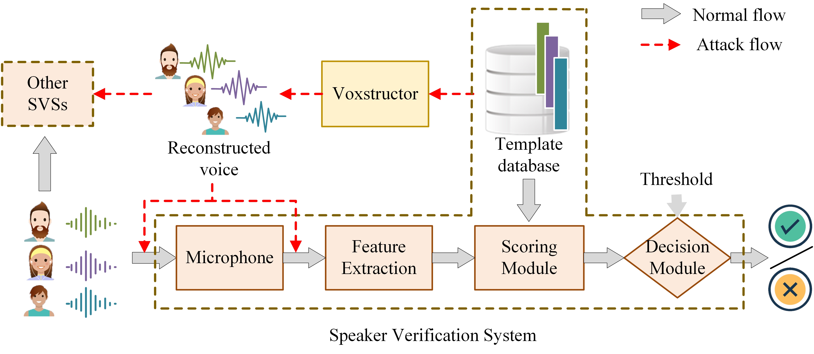
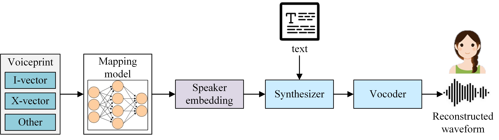

### Hi there 👋

<!--
**voxstructor/voxstructor** is a ✨ _special_ ✨ repository because its `README.md` (this file) appears on your GitHub profile.

Here are some ideas to get you started:

- 🔭 I’m currently working on ...
- 🌱 I’m currently learning ...
- 👯 I’m looking to collaborate on ...
- 🤔 I’m looking for help with ...
- 💬 Ask me about ...
- 📫 How to reach me: ...
- 😄 Pronouns: ...
- ⚡ Fun fact: ...
-->
# Voxstructor
## Voxstructor: Voice Reconstruction from Voiceprint
Applications of Voxstructor:


Overview of Voxstructor:


This repository contains implementation of the models, schemes, and experiments described in the paper [Voxstructor Paper](Voxstructor_ISC21_paper.pdf).
Our paper wins Best Paper Award in [ISC2021](https://isc2021.petra.ac.id/)
### Abstract

With the rapid development of machine learning technologies, voiceprint has become widely used as a personal identifier in daily life. 
Because of that, it is essential to determine to what extent a voiceprint derived from machine learning can be inverted to obtain the original speaker characteristic. However, the reconstruction of voiceprint templates is still a challenging issue. It has also not been proven whether the widespread use of voiceprint poses a privacy leakage risk. 
In this paper, we implement the first comprehensive, holistic, and systematic reconstruction study targeting voiceprint templates. We present Voxstructor, a voiceprint-based voice constructor that can be used for bulk template reconstruction attacks. An attacker can reconstruct a new voice based only on the victim's voiceprint data instead of the voice itself. Specifically, we formalize the voice reconstruction work as an objective optimization problem and merge voice cloning with voiceprint template conversion work. 
We have conducted extensive experiments on multiple mapping models, loss functions, voiceprint template extraction models, scoring methods, and two types of speaker verification attacks. Thorough experiments show that our attacks are effective, achieving a fairly high success rate which is similar to the results generated by voice cloning methods. The time overhead of Voxstructor is far less than other attacks. 
Our study not only demonstrates the need for protection of voiceprint templates in speaker recognition systems, but also shows that Voxstructor can be used as a privacy measure tool for voiceprint privacy-preserving schemes.


### Demo on Use Cases


### How to Run the Model

The required Python version is >= 3.7.
The Pytorch version we used in this project is 

### Cite Us

```
@inproceedings{voxstructor21,
      title={Voxstructor: Voice Reconstruction from Voiceprint}, 
      author={Panpan Lu, Qi Li, Hui Zhu, Giuliano Sovernigo and Xiaodong Lin},
      year={2021},
      booktitle = {24th Information Security Conference, ISC 2021, November 10-12, 2021, Bali, Indonesia},
     pages     = {1--22},
}
```
